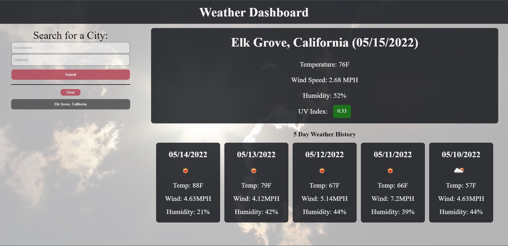

# BC-HW-6
#A Simple Web App to Keep Track of the Weather

Deployed Site [here.](https://tonyavall.github.io/BC-HW-6)

Stack: HTML, CSS, JavaScript

APIs: OpenWeatherMap (GeocodingAPI, WeatherAPI)

##Concept Abstract: 

1. Geocoding and Weather APIs work in tandem, respectively, to:
    a. Grab user city string and fetch API data, returning latitudes(lat) and longitudes(lon) of the city
    b. Returned lats and lons are then used to fetch WeatherAPI data.
2. Added a request user location feature that (if on by default) the app will automatically show the user's location weather

##Approach: 

1. To organize and append lots of data to the page I used objects as parameters with an appendContent function.
2. 3 Ways to fetch weather
    a. User location request
    b. Submit form
    c. Appended city history buttons
3. User input such as lats and lons are stored in objects.

##Project Notes: 

1. Instead of using separate objects for DATE/TEMP/WIND/etc just concatenate data to conserve memory? Also use a for loop for fetchWeatherPast and loop 5 times.
2. NEED to revamp file structure and coding format. Implement SOLID design principles.
3. I think I need a prevention approach to bugs rather than getting code to work and then looking for bugs after.
    a. One way to remedy this is to make a design doc first and pseudocode.
    b. I also need to always keep in mind to write cleaner, more readable code. I really tried to separate function concerns, but I struggled with it.